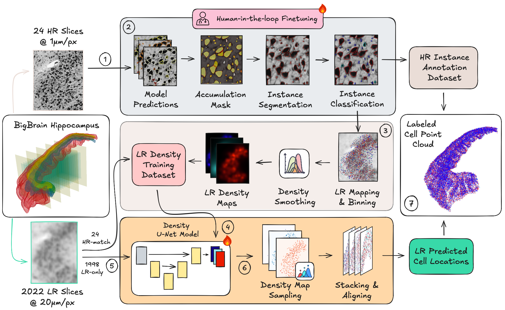
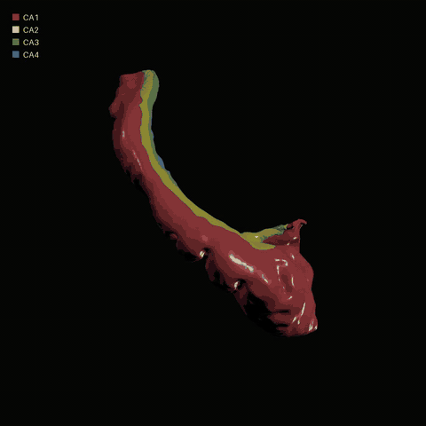

# CALHippo Framework - the framework for the Cellular Annotation Labels for Hippocampus dataset


This repo is a BigBrain hippocampus workflow repository. It preprocesses raw
high-resolution (HR) (a) and low-resolution (LR) (e) BigBrain slices, segments and
classifies HR cells (b), maps the annotations into LR space (c), trains LR density models (d),
runs full-slice LR inference (f), and reconstructs 3D point-cloud outputs (g).



## CA Mesoscale Cell Resolved Point Cloud

<p align="center">
  <a href="media/ca_pointcloud_infographic_web.webm">
    
  </a>
</p>

<p align="center">
  <a href="media/ca_pointcloud_infographic_web.webm">Watch the high res video version</a>
</p>

## Setup

Clone this repo, `cd` into the repository folder `neuro_brain` and install [uv](https://docs.astral.sh/uv/getting-started/installation/):

```bash
curl -LsSf https://astral.sh/uv/install.sh | sh
#or if you don't have curl installed:
wget -qO- https://astral.sh/uv/install.sh | sh
```

Then install the dependencies:

```bash
uv sync
```

Optionally activate the environment:

```bash
source .venv/bin/activate
```

or run `.py` files directly using `uv run` instead of `python`.

## Pipeline Usage

To reproduce and/or use the pipeline, read the following documents in order:

| Document | Use it for |
| --- | --- |
| [Data setup](documents/data_setup.md) | Data sources, setup script, folder structure, transform notes |
| [Pipeline instructions](documents/pipeline.md) | Reproducibility path and inference-stage commands after data setup |
| [HR/LR coordinate conventions](documents/hr_lr_coordinate_conventions.md) | Coordinate and affine rules for HR to LR mapping |
| [HR/LR mapping notebook](notebooks/misc/hr_lr_mapping.ipynb) | Visual/debug reference for HR/LR mapping |

## Data Layout

The maintained documentation uses a single configurable `<DATA_ROOT>` convention.
The canonical tree is specified in [Data setup](documents/data_setup.md).

Key folders:

- raw inputs live under `<DATA_ROOT>/raw/high_res`, `<DATA_ROOT>/raw/low_res`, and `<DATA_ROOT>/raw/masks`
- preprocessing outputs live under `<DATA_ROOT>/input/all_regions` and `<DATA_ROOT>/input/single_regions`
- optional manually adjusted HR ROI masks can live under `<DATA_ROOT>/input/custom_masks/high_res` and be used explicitly during HR single-region extraction
- pipeline outputs live under `<DATA_ROOT>/output/segmentation`, `<DATA_ROOT>/output/classification`, `<DATA_ROOT>/output/lr_density_dataset`, `<DATA_ROOT>/output/test_lr_density_gt`, `<DATA_ROOT>/output/lr_gt_eval`, `<DATA_ROOT>/output/full_lr_predictions`, and `<DATA_ROOT>/output/mesoscale_reconstruction`
- density-estimator training runs live under `<DATA_ROOT>/density_estimator_training`
- released and trained model artifacts live under `<DATA_ROOT>/models`

The maintained LR inference output is
`<DATA_ROOT>/output/full_lr_predictions/allCA_best_model_128_96_smooth_b05_k5_roi`.
Point-cloud reconstruction consumes a prediction folder such as
`<DATA_ROOT>/output/full_lr_predictions/<PREDICTIONS_NAME>` plus LR bbox JSONs and
raw LR MINC files, then writes
`<DATA_ROOT>/output/mesoscale_reconstruction/<PREDICTIONS_NAME>/point_cloud.csv`.

Maintained region names are `RCA1`, `RCA2`, `RCA3`, and `RCA4`.

## Development

Install the dev dependencies:

```bash
uv sync --dev
```

Use ruff to check and format the code:

```bash
uv run ruff check .
uv run ruff format .
```

Developer reference:
- [Test pipeline](documents/test_pipeline.md) Smoke test for the pipeline with few example datae
- [Utils function usage](documents/utils_functions.md) audits shared `src/utils` functions and cleanup candidates.

See `AGENTS.md` for repository-specific development guidance.

## Citations

If you use this repository please cite both the following
resources:

```bibtex
@article{Amunts2013BigBrain,
  author  = {Amunts, Katrin and Lepage, Claude and Borgeat, Louis and
             Mohlberg, Hartmut and Dickscheid, Timo and Rousseau, Marc-Etienne and
             Bludau, Sebastian and Bazin, Pierre-Louis and Lewis, Lindsay B. and
             Oros-Peusquens, Anne-Marie and Shah, N. Jon and Lippert, Thomas and
             Zilles, Karl and Evans, Alan C.},
  title   = {BigBrain: An ultrahigh-resolution 3D human brain model},
  journal = {Science},
  year    = {2013},
  volume  = {340},
  number  = {6139},
  pages   = {1472--1475},
  doi     = {10.1126/science.1235381},
  url     = {https://doi.org/10.1126/science.1235381}
}

@misc{bigbrain-hr,
  removed_doi = {10.25493/JWTF-PAB},
  url = {https://search.kg.ebrains.eu/instances/73c1fa55-d099-4854-8cda-c9a403c6080a},
  removed_author = {Schiffer, Christian and Lepage, Claude and Omidyeganeh, Mona and Mohlberg, Hartmut and Brandstetter, Andrea and Bludau, Sebastian and Heuer, Katja and Toussaint, Paule-Joanne and Wenzel, Susanne and Dickscheid, Timo and Evans, Alan C. and Amunts, Katrin},
  author = {Schiffer, Christian and others},
  title = {{Selected 1 micron scans of BigBrain histological sections (v1.0)}},
  howpublished = {EBRAINS, 2022},
  removed_year = {2022},
  removed_copyright = {Creative Commons Attribution Non Commercial Share Alike 4.0 International}
}

@article{Pachitariu2025,
  title={Cellpose-SAM: superhuman generalization for cellular segmentation},
  author={Pachitariu, Marius and Rariden, Michael and Stringer, Carsen},
  journal={BioRxiv},
  pages={2025--04},
  year={2025},
  publisher={Cold Spring Harbor Laboratory}
}

@article{Chen2024,
  title={Towards a General-Purpose Foundation Model for Computational Pathology},
  author={Chen, Richard J and Ding, Tong and Lu, Ming Y and Williamson, Drew FK and Jaume, Guillaume and Chen, Bowen and Zhang, Andrew and Shao, Daniel and Song, Andrew H and Shaban, Muhammad and others},
  journal={Nature Medicine},
  publisher={Nature Publishing Group},
  year={2024}
}

@article{Goldsborough2024,
  title={InstanSeg: an embedding-based instance segmentation algorithm optimized for accurate, efficient and portable cell segmentation},
  author={Goldsborough, Thibaut and Philps, Ben and O'Callaghan, Alan and Inglis, Fiona and Leplat, Leo and Filby, Andrew and Bilen, Hakan and Bankhead, Peter},
  journal={arXiv preprint arXiv:2408.15954},
  year={2024}
}

@inproceedings{Schmidt2018,
  title={Cell detection with star-convex polygons},
  author={Schmidt, Uwe and Weigert, Martin and Broaddus, Coleman and Myers, Gene},
  booktitle={International conference on medical image computing and computer-assisted intervention},
  pages={265--273},
  year={2018},
  organization={Springer}
}

@article{Graham2019,
  title={Hover-net: Simultaneous segmentation and classification of nuclei in multi-tissue histology images},
  author={Graham, Simon and Vu, Quoc Dang and Raza, Shan E Ahmed and Azam, Ayesha and Tsang, Yee Wah and Kwak, Jin Tae and Rajpoot, Nasir},
  journal={Medical image analysis},
  volume={58},
  pages={101563},
  year={2019},
  publisher={Elsevier}
}
```
