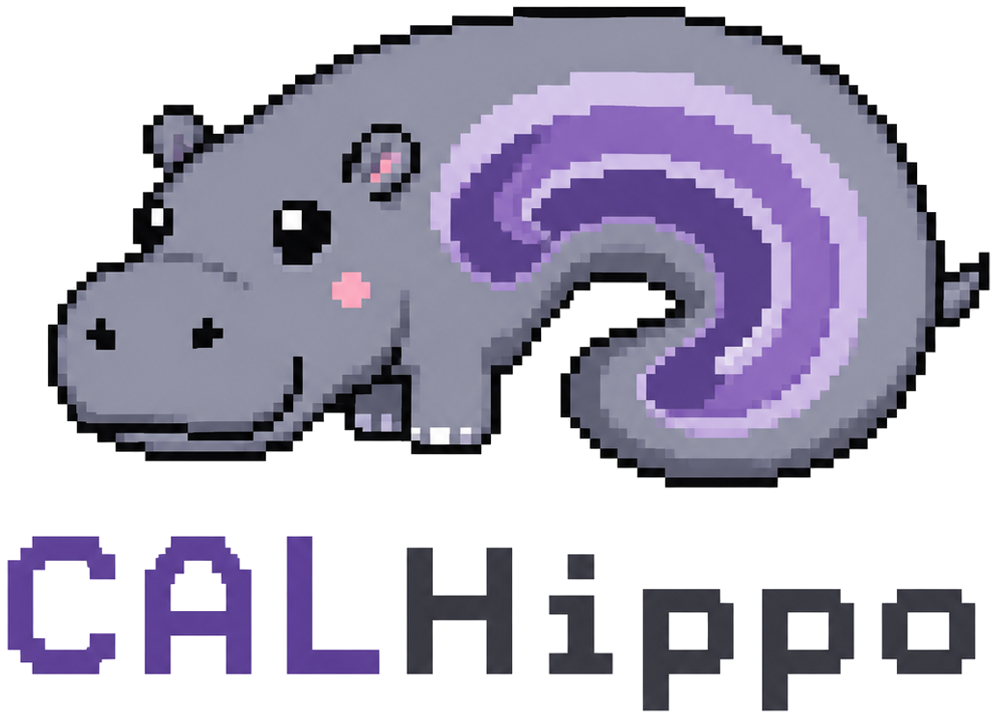

# CALHippo Framework - Codebase of the Cellular Annotation Library for the Hippocampus


[](https://ditto.ing.unimore.it/calhippo/)
[](https://huggingface.co/AImageLab-Zip/CALHippo-Framework-Models)

> [!IMPORTANT]
> CALHippo has been accepted at [MICCAI 2026](https://conferences.miccai.org/2026/)! The current preprint version is available [here](https://federicobolelli.it/media/publications/pdfs/Paper-0727.pdf). See the [citation](#citations) below.
> 
> [](https://federicobolelli.it/media/publications/pdfs/Paper-0727.pdf)
> [](https://ditto.ing.unimore.it/calhippo/)
>
> The released dataset includes preprocessed HR crops, classified cell annotations, and a mesoscale point cloud. Use it to skip HR data preprocessing, segmentation, and classification; see [Data setup](documents/data_setup.md).

This repository contains the official framework associated with the **CALHippo dataset**. It provides a multiscale workflow that bridges microscopic cell instances and macroscopic brain architecture, enabling the generation of biologically plausible 3D cellular point clouds from BigBrain histological sections.

<div align="center">
  
</div>

## Pipeline

The framework preprocesses raw
high-resolution (HR) (a) and low-resolution (LR) (e) BigBrain slices, segments and
classifies HR cells (b), maps the annotations into LR space (c), trains LR density models (d),
runs full-slice LR inference (f), and reconstructs 3D point-cloud outputs (g).


## Results

<table align="center">
  <tr>
    <td align="center" width="50%">
      <a href="media/hr_merging_and_classification/hr_merging_and_classification_3096_RCA3.mp4">
        
      </a>
    </td>
    <td align="center" width="50%">
      <a href="media/lr_density_predictions/lr_density_predictions_3096.mp4">
        
      </a>
    </td>
  </tr>
  <tr>
    <td align="center"><strong>HR Segmentation, Merging and Classification (b)</strong></td>
    <td align="center"><strong>LR Full-Slice Density Prediction and Sampling (f)</strong></td>
  </tr>
</table>

<table align="center">
  <tr>
    <td align="center" colspan="2" width="100%">
      <a href="media/point_cloud_and_ca_infographic/ca_pointcloud_infographic.mp4">
        
      </a>
    </td>
  </tr>
  <tr>
    <td align="center" colspan="2"><strong>All CA Class Resolved Point Cloud Reconstruction (g)</strong></td>
  </tr>
  <tr>
    <td align="center" width="50%">
      
    </td>
    <td align="center" width="50%">
      
    </td>
  </tr>
  <tr>
    <td align="center" colspan="2"><strong>All CA Mesocale Volumes (left) and predicted point cloud (right)</strong></td>
  </tr>
</table>

## Setup

Clone this repo, `cd` into the repository root and install [uv](https://docs.astral.sh/uv/getting-started/installation/):

```bash
curl -LsSf https://astral.sh/uv/install.sh | sh
#or if you don't have curl installed:
wget -qO- https://astral.sh/uv/install.sh | sh
```

Then install the dependencies:

```bash
uv sync
```

Optionally activate the environment:

```bash
source .venv/bin/activate
```

or run `.py` files directly using `uv run` instead of `python`.

## Pipeline Usage

The released CALHippo dataset is available at
[https://ditto.ing.unimore.it/calhippo/](https://ditto.ing.unimore.it/calhippo/).
It includes 24 high-resolution BigBrain slices with CA1-CA4 cell annotations and
a mesoscale point cloud. If you download it, you can place the files into the
expected `data/` layout and start from LR density dataset creation instead of
rerunning HR preprocessing, segmentation, and classification.

```bash
uv run python scripts/setup_data.py --data-root data --calhippo-dataset-zip CALHippo_Dataset_v1.0.zip
```

To reproduce and/or use the pipeline, read the following documents in order:

| Document | Use it for |
| --- | --- |
| [Data setup](documents/data_setup.md) | Data sources, setup script, folder structure, transform notes |
| [Pipeline instructions](documents/pipeline.md) | Reproducibility path and inference-stage commands after data setup |
| [HR/LR coordinate conventions](documents/hr_lr_coordinate_conventions.md) | Coordinate and affine rules for HR to LR mapping |
| [HR/LR mapping notebook](notebooks/misc/hr_lr_mapping.ipynb) | Visual/debug reference for HR/LR mapping |

## Data Layout

The maintained documentation uses a single configurable `<DATA_ROOT>` convention.
The canonical tree is specified in [Data setup](documents/data_setup.md).

Key folders:

- raw inputs live under `<DATA_ROOT>/raw/high_res`, `<DATA_ROOT>/raw/low_res`, and `<DATA_ROOT>/raw/masks`
- preprocessing outputs live under `<DATA_ROOT>/input/all_regions` and `<DATA_ROOT>/input/single_regions`
- optional manually adjusted HR ROI masks can live under `<DATA_ROOT>/input/custom_masks/high_res` and be used explicitly during HR single-region extraction
- pipeline outputs live under `<DATA_ROOT>/output/segmentation`, `<DATA_ROOT>/output/classification`, `<DATA_ROOT>/output/lr_density_dataset`, `<DATA_ROOT>/output/test_lr_density_gt`, `<DATA_ROOT>/output/lr_gt_eval`, `<DATA_ROOT>/output/full_lr_predictions`, and `<DATA_ROOT>/output/mesoscale_reconstruction`
- density-estimator training runs live under `<DATA_ROOT>/density_estimator_training`
- released and trained model artifacts live under `<DATA_ROOT>/models`

The maintained LR inference output is
`<DATA_ROOT>/output/full_lr_predictions/allCA_best_model_128_96_smooth_b05_k5_roi`.
Point-cloud reconstruction consumes a prediction folder such as
`<DATA_ROOT>/output/full_lr_predictions/<PREDICTIONS_NAME>` plus LR bbox JSONs and
raw LR MINC files, then writes
`<DATA_ROOT>/output/mesoscale_reconstruction/<PREDICTIONS_NAME>/point_cloud.csv`.

Maintained region names are `RCA1`, `RCA2`, `RCA3`, and `RCA4`.

## Development

Install the dev dependencies:

```bash
uv sync --dev
```

Use ruff to check and format the code:

```bash
uv run ruff check .
uv run ruff format .
```

Developer reference:
- [Test pipeline](documents/test_pipeline.md) Smoke test for the pipeline with few example datae
- [Utils function usage](documents/utils_functions.md) audits shared `src/utils` functions and cleanup candidates.

See `AGENTS.md` for repository-specific development guidance.

## License

Original CALHippo source code is released under the Apache License 2.0.

Code authors: Giovanni Casari and Ettore Candeloro, equal contribution.

Model weights, trained checkpoints, datasets, derived annotations, rendered
figures, notebook outputs, and other BigBrain-derived artifacts are not covered
by the Apache License 2.0. These artifacts are released under Creative Commons
Attribution-NonCommercial-ShareAlike 4.0 International (CC BY-NC-SA 4.0) for
non-commercial academic research use only.

Some parts of this repository include copied or modified code from upstream
model projects used by the pipeline, including Cellpose, HoVer-Net, InstanSeg,
StarDist, and related dependencies. Those files remain subject to their original
upstream licenses and copyright notices. Where applicable, upstream notices are
retained in the corresponding source folders and/or in `THIRD_PARTY_NOTICES.md`.

UNI2-h weights are not redistributed by this repository. Users who need the
UNI2-h classification path must request access from the upstream provider and
authenticate locally.

The CALHippo framework, released weights, and derived artifacts are intended for
non-commercial research use and are not intended for clinical diagnosis, medical
decision-making, or commercial deployment.

## Citations

If you use our dataset/code you must cite the following:

```bibtex
@inproceedings{2026MICCAI_calhippo,
  title={CALHippo: Cell Segmentation for Neuronal Density Inference in the Human Hippocampus},
  author={Casari, Giovanni and Candeloro, Ettore and Gandolfi, Daniela and Mapelli, Jonathan and Bolelli, Federico and Grana, Costantino},
  year={2026},
  month={June},
  book={Medical Image Computing and Computer Assisted Intervention – MICCAI 2026},
  booktitle={Medical Image Computing and Computer Assisted Intervention – MICCAI 2026},
  venue={Strasbourg, France},
  keywords={Human Brain, Cell Segmentation, Density Estimation}
}
```
